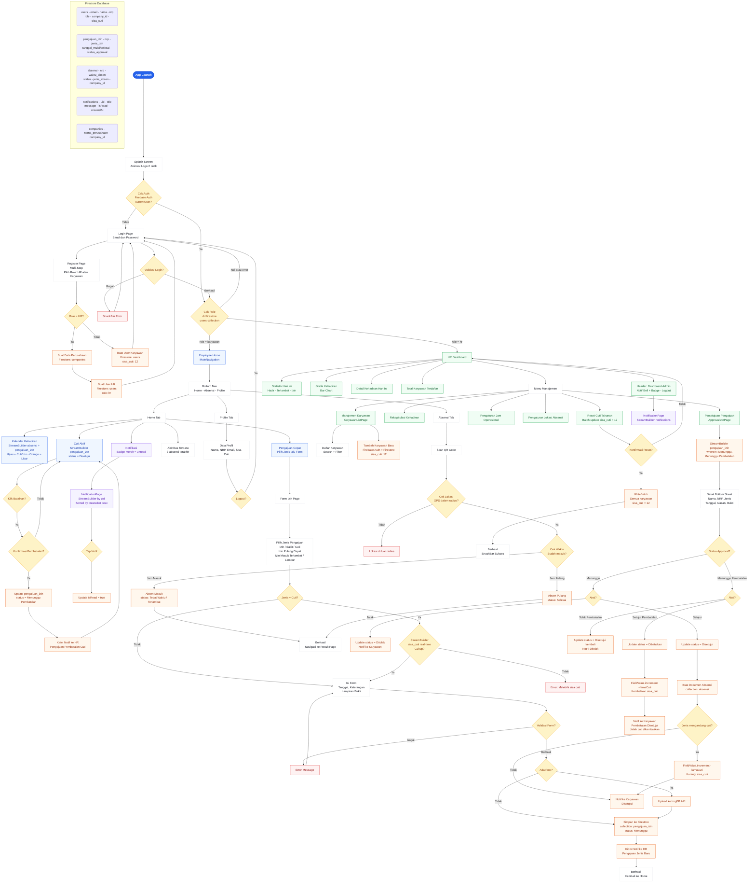

# Attendify - Application Flowchart

```mermaid
flowchart TD
    classDef startEnd fill:#2563EB,stroke:#1D4ED8,color:#fff,font-weight:bold
    classDef process fill:#fff,stroke:#E5E7EB,color:#1A1D26
    classDef decision fill:#FEF3C7,stroke:#F59E0B,color:#92400E
    classDef firebase fill:#FFF7ED,stroke:#EA580C,color:#9A3412
    classDef hrAction fill:#F0FDF4,stroke:#16A34A,color:#166534
    classDef empAction fill:#EFF6FF,stroke:#2563EB,color:#1E40AF
    classDef notif fill:#F5F3FF,stroke:#7C3AED,color:#5B21B6
    classDef danger fill:#FEF2F2,stroke:#DC2626,color:#991B1B

    START([App Launch]):::startEnd
    SPLASH[Splash Screen<br/>Animasi Logo 2 detik]:::process
    AUTH_CHECK{Cek Auth<br/>Firebase Auth<br/>currentUser?}:::decision

    START --> SPLASH --> AUTH_CHECK

    AUTH_CHECK -- Tidak --> LOGIN[Login Page<br/>Email dan Password]:::process
    AUTH_CHECK -- Ya --> ROLE_CHECK{Cek Role<br/>di Firestore<br/>users collection}:::decision

    LOGIN --> LOGIN_VALID{Validasi Login?}:::decision
    LOGIN_VALID -- Gagal --> LOGIN_ERR[SnackBar Error]:::danger
    LOGIN_ERR --> LOGIN
    LOGIN_VALID -- Berhasil --> ROLE_CHECK

    LOGIN --> REGIST[Register Page<br/>Multi-Step<br/>Pilih Role: HR atau Karyawan]:::process
    REGIST --> REGIST_HR{Role = HR?}:::decision
    REGIST_HR -- Ya --> CREATE_COMPANY[Buat Data Perusahaan<br/>Firestore: companies]:::firebase
    REGIST_HR -- Tidak --> CREATE_USER_K[Buat User Karyawan<br/>Firestore: users<br/>sisa_cuti: 12]:::firebase
    CREATE_COMPANY --> CREATE_USER_HR[Buat User HR<br/>Firestore: users<br/>role: hr]:::firebase
    CREATE_USER_HR --> LOGIN
    CREATE_USER_K --> LOGIN

    ROLE_CHECK -- role = hr --> HR_DASH[HR Dashboard]:::hrAction
    ROLE_CHECK -- role = karyawan --> EMP_HOME[Employee Home<br/>MainNavigation]:::empAction
    ROLE_CHECK -- null atau error --> LOGIN

    EMP_HOME --> EMP_NAV[Bottom Nav<br/>Home - Absensi - Profile]:::process
    EMP_NAV --> HOME_TAB[Home Tab]:::process
    EMP_NAV --> ABSEN_TAB[Absensi Tab]:::process
    EMP_NAV --> PROF_TAB[Profile Tab]:::process

    HOME_TAB --> CALENDAR[Kalender Kehadiran<br/>StreamBuilder absensi + pengajuan_izin<br/>Hijau = Cuti/Izin - Orange = Libur]:::empAction
    HOME_TAB --> ACTIVE_CUTI[Cuti Aktif<br/>StreamBuilder pengajuan_izin<br/>status = Disetujui]:::empAction
    HOME_TAB --> QUICK_SUBMIT[Pengajuan Cepat<br/>Pilih Jenis lalu Form]:::empAction
    HOME_TAB --> RECENT[Aktivitas Terbaru<br/>3 absensi terakhir]:::process
    HOME_TAB --> BELL[Notifikasi<br/>Badge merah = unread]:::notif

    ACTIVE_CUTI --> CANCEL_BTN{Klik Batalkan?}:::decision
    CANCEL_BTN -- Ya --> CANCEL_CONFIRM{Konfirmasi Pembatalan?}:::decision
    CANCEL_CONFIRM -- Tidak --> ACTIVE_CUTI
    CANCEL_CONFIRM -- Ya --> CANCEL_SAVE[Update pengajuan_izin<br/>status = Menunggu Pembatalan]:::firebase
    CANCEL_SAVE --> CANCEL_NOTIF[Kirim Notif ke HR<br/>Pengajuan Pembatalan Cuti]:::firebase
    CANCEL_NOTIF --> ACTIVE_CUTI

    BELL --> NOTIF_PAGE[NotificationPage<br/>StreamBuilder by uid<br/>Sorted by createdAt desc]:::notif
    NOTIF_PAGE --> NOTIF_TAP{Tap Notif}:::decision
    NOTIF_TAP --> NOTIF_READ[Update isRead = true]:::firebase

    QUICK_SUBMIT --> FORM_START[Form Izin Page]:::process
    FORM_START --> PILIH_JENIS[Pilih Jenis Pengajuan<br/>Izin / Sakit / Cuti<br/>Izin Pulang Cepat<br/>Izin Masuk Terlambat / Lembur]:::process
    PILIH_JENIS --> IS_CUTI{Jenis = Cuti?}:::decision
    IS_CUTI -- Ya --> CEK_SISA{StreamBuilder<br/>sisa_cuti real-time<br/>Cukup?}:::decision
    IS_CUTI -- Tidak --> FILL_FORM[Isi Form<br/>Tanggal, Keterangan<br/>Lampiran Bukti]:::process
    CEK_SISA -- Tidak --> CUTI_ERR[Error: Melebihi sisa cuti]:::danger
    CEK_SISA -- Ya --> FILL_FORM
    FILL_FORM --> VALIDASI{Validasi Form?}:::decision
    VALIDASI -- Gagal --> FORM_ERR[Error Message]:::danger
    FORM_ERR --> FILL_FORM
    VALIDASI -- Berhasil --> UPLOAD_FOTO{Ada Foto?}:::decision
    UPLOAD_FOTO -- Ya --> UPLOAD_IMGBB[Upload ke ImgBB API]:::firebase
    UPLOAD_FOTO -- Tidak --> SAVE_PENGAJUAN
    UPLOAD_IMGBB --> SAVE_PENGAJUAN
    SAVE_PENGAJUAN[Simpan ke Firestore<br/>collection: pengajuan_izin<br/>status: Menunggu]:::firebase
    SAVE_PENGAJUAN --> NOTIF_HR[Kirim Notif ke HR<br/>Pengajuan Jenis Baru]:::firebase
    NOTIF_HR --> FORM_DONE[Berhasil<br/>Kembali ke Home]:::process

    ABSEN_TAB --> SCAN_QR[Scan QR Code]:::process
    SCAN_QR --> CEK_LOKASI{Cek Lokasi<br/>GPS dalam radius?}:::decision
    CEK_LOKASI -- Ya --> CEK_JAM{Cek Waktu<br/>Sudah masuk?}:::decision
    CEK_LOKASI -- Tidak --> ABSEN_ERR[Lokasi di luar radius]:::danger
    CEK_JAM -- Jam Masuk --> ABSEN_IN[Absen Masuk<br/>status: Tepat Waktu / Terlambat]:::firebase
    CEK_JAM -- Jam Pulang --> ABSEN_OUT[Absen Pulang<br/>status: Selesai]:::firebase
    ABSEN_IN --> ABSEN_OK[Berhasil<br/>Navigasi ke Result Page]:::process
    ABSEN_OUT --> ABSEN_OK

    PROF_TAB --> PROFIL[Data Profil<br/>Nama, NRP, Email, Sisa Cuti]:::process
    PROFIL --> LOGOUT_EMP{Logout?}:::decision
    LOGOUT_EMP -- Ya --> LOGIN

    HR_DASH --> HR_HEADER[Header: Dashboard Admin<br/>Notif Bell + Badge - Logout]:::hrAction
    HR_DASH --> HR_STAT[Statistik Hari Ini<br/>Hadir - Terlambat - Izin]:::hrAction
    HR_DASH --> HR_CHART[Grafik Kehadiran<br/>Bar Chart]:::hrAction
    HR_DASH --> HR_TODAY[Detail Kehadiran Hari Ini]:::hrAction
    HR_DASH --> HR_TOTAL[Total Karyawan Terdaftar]:::hrAction
    HR_DASH --> HR_MENU[Menu Manajemen]:::process

    HR_MENU --> M_KARYAWAN[Manajemen Karyawan<br/>KaryawanListPage]:::hrAction
    HR_MENU --> M_REKAP[Rekapitulasi Kehadiran]:::hrAction
    HR_MENU --> M_APPROVAL[Persetujuan Pengajuan<br/>ApprovalIzinPage]:::hrAction
    HR_MENU --> M_JAM[Pengaturan Jam Operasional]:::hrAction
    HR_MENU --> M_LOKASI[Pengaturan Lokasi Absensi]:::hrAction
    HR_MENU --> M_RESET[Reset Cuti Tahunan<br/>Batch update sisa_cuti = 12]:::hrAction

    M_KARYAWAN --> EMP_LIST[Daftar Karyawan<br/>Search + Filter]:::process
    M_KARYAWAN --> ADD_EMP[Tambah Karyawan Baru<br/>Firebase Auth + Firestore<br/>sisa_cuti: 12]:::firebase

    M_RESET --> RESET_CONFIRM{Konfirmasi Reset?}:::decision
    RESET_CONFIRM -- Ya --> RESET_BATCH[WriteBatch<br/>Semua karyawan<br/>sisa_cuti = 12]:::firebase
    RESET_CONFIRM -- Tidak --> HR_DASH
    RESET_BATCH --> RESET_OK[Berhasil<br/>SnackBar Sukses]:::process

    HR_HEADER --> HR_NOTIF[NotificationPage<br/>StreamBuilder notifications]:::notif

    M_APPROVAL --> STREAM_LIST[StreamBuilder pengajuan_izin<br/>whereIn: Menunggu,<br/>Menunggu Pembatalan]:::firebase
    STREAM_LIST --> DETAIL[Detail Bottom Sheet<br/>Nama, NRP, Jenis<br/>Tanggal, Alasan, Bukti]:::process
    DETAIL --> CEK_STATUS{Status Approval?}:::decision

    CEK_STATUS -- Menunggu --> NEW_ACTION{Aksi?}:::decision
    NEW_ACTION -- Tolak --> REJECT[Update status = Ditolak<br/>Notif ke Karyawan]:::firebase
    NEW_ACTION -- Setujui --> APPROVE[Update status = Disetujui]:::firebase
    APPROVE --> CREATE_ABSEN[Buat Dokumen Absensi<br/>collection: absensi]:::firebase
    CREATE_ABSEN --> CEK_CUTI{Jenis mengandung cuti?}:::decision
    CEK_CUTI -- Ya --> POTONG_CUTI[FieldValue.increment -lamaCuti<br/>Kurangi sisa_cuti]:::firebase
    CEK_CUTI -- Tidak --> APPROVE_NOTIF[Notif ke Karyawan<br/>Disetujui]:::firebase
    POTONG_CUTI --> APPROVE_NOTIF

    CEK_STATUS -- Menunggu Pembatalan --> CANCEL_ACTION{Aksi?}:::decision
    CANCEL_ACTION -- Tolak Pembatalan --> REJECT_CANCEL[Update status = Disetujui kembali<br/>Notif: Ditolak]:::firebase
    CANCEL_ACTION -- Setujui Pembatalan --> APPROVE_CANCEL[Update status = Dibatalkan]:::firebase
    APPROVE_CANCEL --> REFUND_CUTI[FieldValue.increment +lamaCuti<br/>Kembalikan sisa_cuti]:::firebase
    REFUND_CUTI --> CANCEL_NOTIF2[Notif ke Karyawan<br/>Pembatalan Disetujui<br/>Jatah cuti dikembalikan]:::firebase

    subgraph DB[" Firestore Database "]
        DB_USERS(users - email - nama - nrp<br/>role - company_id - sisa_cuti)
        DB_PENGAJUAN(pengajuan_izin - nrp - jenis_izin<br/>tanggal_mulai/selesai - status_approval)
        DB_ABSENSI(absensi - nrp - waktu_absen<br/>status - jenis_absen - company_id)
        DB_NOTIF(notifications - uid - title<br/>message - isRead - createdAt)
        DB_COMPANY(companies - nama_perusahaan - company_id)
    end
```
